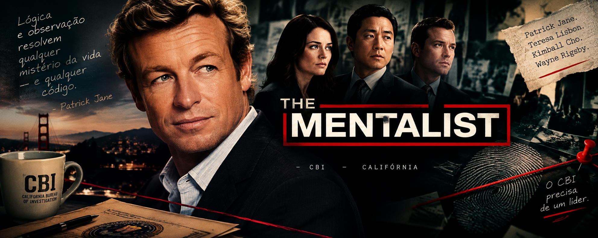

<p align="center">
  
</p>

<p align="center">
  <strong>CBI CASE 001</strong><br>
  <em>Four candidates. One CBI. One final vote.</em>
</p>
<h3>Qual personagem de The Mentalist merece o seu voto?</h3>
Por favor, escolha o seu.
Este projeto transforma um exercício de **Laboratório de Programação** em uma pequena eleição inspirada em *The Mentalist*.
A proposta é simples: você escolhe um dos quatro personagens, o programa registra os votos e, no final, apresenta os resultados da votação.

## Candidatos

| Código | Candidato        |
| :----: | ---------------- |
|    1   | Patrick Jane     |
|    2   | Teresa Lisbon    |
|    3   | Kimball Cho      |
|    4   | Wayne Rigsby     |
|    5   | Voto nulo        |
|    6   | Voto em branco   |
|    0   | Encerrar votação |

## Como funciona
O programa permanece recebendo votos até que o código `0` seja informado.
Durante a votação, cada entrada válida é contabilizada. Quando a votação termina, o programa mostra:

* quantidade de votos de cada candidato;
* total de votos nulos;
* total de votos em branco;
* total geral de votos;
* porcentagem de votos de cada candidato;
* porcentagem de votos nulos;
* porcentagem de votos em branco;
* candidato com maior número de votos.

Códigos que não fazem parte das opções disponíveis são considerados inválidos e não entram na contagem.
## Exemplo
Uma possível votação:

```text
Digite o código do seu voto: 1
Digite o código do seu voto: 2
Digite o código do seu voto: 1
Digite o código do seu voto: 4
Digite o código do seu voto: 3
Digite o código do seu voto: 1
Digite o código do seu voto: 0
```

Ao encerrar, o programa calcula e apresenta o resultado da eleição.
```text
=======================================================
           RESULTADO FINAL DA ELEIÇÃO CBI
=======================================================

Patrick Jane:       3 voto(s) - 50.00%
Teresa Lisbon:      1 voto(s) - 16.67%
Kimball Cho:        1 voto(s) - 16.67%
Wayne Rigsby:       1 voto(s) - 16.67%

-------------------------------------------------------

Total de votos Nulos:             0 - 0.00%
Total de votos em Branco:         0 - 0.00%
Total Geral de Votos:             6 - 100.00%

-------------------------------------------------------

NOVO LÍDER DA CBI:                Patrick Jane

=======================================================
```

## O que foi praticado
O projeto utiliza apenas conceitos fundamentais de Python:

* variáveis;
* entrada de dados com `input()`;
* saída com `print()`;
* estruturas condicionais `if`, `elif` e `else`;
* repetição com `while`;
* operadores matemáticos;
* contadores;
* função `max()`;
* f-strings;
* cálculo de porcentagens.
A ideia foi resolver o problema de forma direta, utilizando os conceitos trabalhados na disciplina.

## A ideia por trás do projeto

Em vez de fazer apenas uma implementação genérica de uma eleição, escolhi usar personagens de *The Mentalist* para dar uma identidade ao exercício.
O resultado é um projeto simples, mas que permite praticar uma lógica que aparece em vários sistemas reais: receber dados, validar entradas, armazenar contagens, processar informações e apresentar um resultado.
E, claro, existe uma questão importante:
**Quem você escolheria para comandar o CBI?**


## Tecnologia
**Python 3**

## Contexto acadêmico
Projeto desenvolvido para a disciplina de **Laboratório de Programação**.

**Curso:** Engenharia de Software
**Instituição:** UNIUBE
**Autora:** Elza Vitória Mendes Silva Aquino

---

> “Lógica e observação resolvem qualquer mistério da vida — e qualquer código.”
> 100% PYTHON
> — Elza Vitória Mendes Silva Aquino
---

## Fim da investigação

<p align="center">
  
</p>

<h3>Obrigado por participar da eleição.
A decisão agora é sua.</h3>
